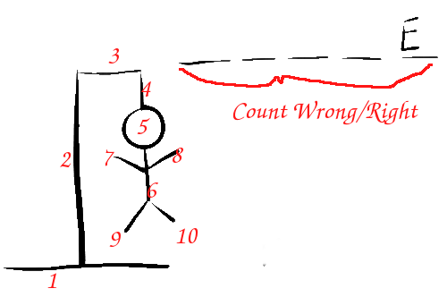

## Hangman Extreme

An exercise for adding micro-tests after code is written.

Get the code: 

    git clone https://github.com/pete-the-programmer/tdd-ex-micro1

Start by testing simple, yet interesting behaviours, and progressively get more complex.

For example:

1. How many letters need to be displayed?
1. Is there a limit to the number of letters?
1. What happens when the user makes a guess?
1. What happens when the user guesses the same letter twice? 
1. How can we tell between an incorrect and correct guess?
1. What are the limits on numbers of guesses?
1. How does the user win or lose?
